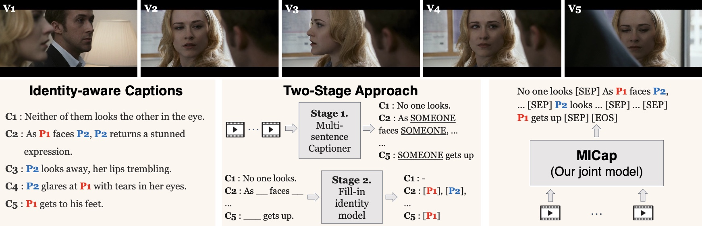

# MICap: A Unified Model for Identity-aware Movie Descriptions


[](https://arxiv.org/abs/2405.11483)
[](https://katha-ai.github.io/projects/micap/)
<a href="https://huggingface.co/spaces/dnaveenr/iSPICE-Metric" target="_blank">
    
</a>


## Overview

This repository contains the official code for CVPR 2024 paper "MICap: A Unified Model for Identity-aware Movie Descriptions". 



## Installation

Run the following commands to clone the repository
```
git clone https://github.com/katha-ai/MovieIdentityCaptioner-CVPR2024.git
cd MovieIdentityCaptioner-CVPR2024
```

#### Environment

Install the required conda environment by running the following command:
`conda env create -f conda_env.yml`

#### Data

Details Coming soon....


## Training

The `run_type` flag in the `config_base.yaml` file can be adjusted to determine the task (either `fitb`, `fc` only, or both) for training MICap.

Make sure the `overfit` and `checkpoint` flags are set to `False`. Also, ensure the path relative to the features from the data directory is correctly set in the `config_base.yaml` file.

Once the yaml file is set run the command:`python train_mod.py`

## Evaluation

To evaluate a pretrained model, set the `checkpoint` flag to `True` in the `config_base.yaml` file.

The `run_type` flag in the `config_base.yaml` file can be adjusted to specify the task for evaluation.

Once the yaml file is set run the command:`python train_mod.py`


## Citation

Please consider citing our paper if the project helps your research with the following BibTex:

```bibtex
@inproceedings{raajesh2024micap,
  title={MICap: A Unified Model for Identity-aware Movie Descriptions},
  author={Raajesh, Haran and Desanur, Naveen Reddy and Khan, Zeeshan and Tapaswi, Makarand},
  booktitle={Proceedings of the IEEE/CVF Conference on Computer Vision and Pattern Recognition},
  pages={14011--14021},
  year={2024}
}
```
